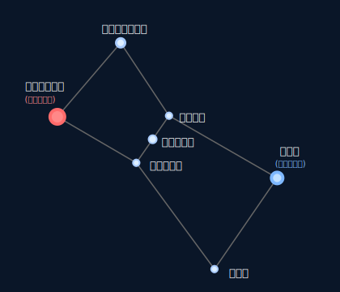
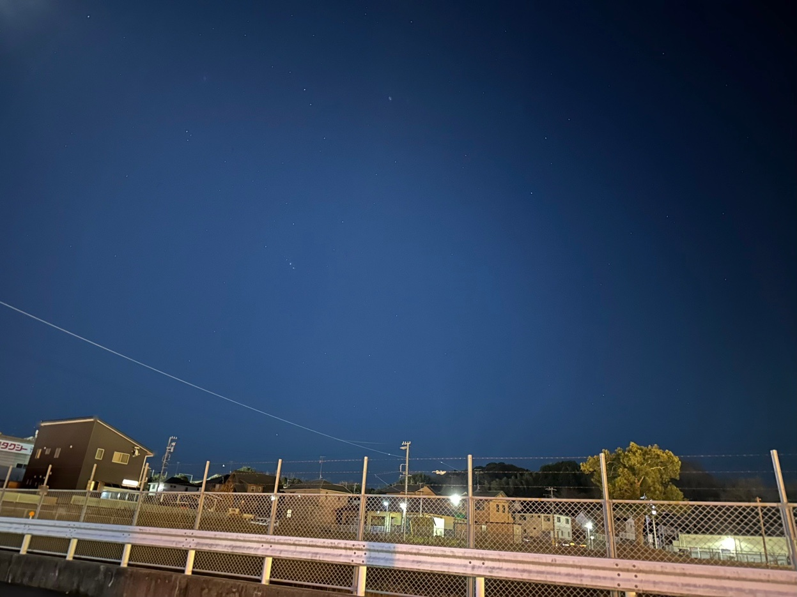
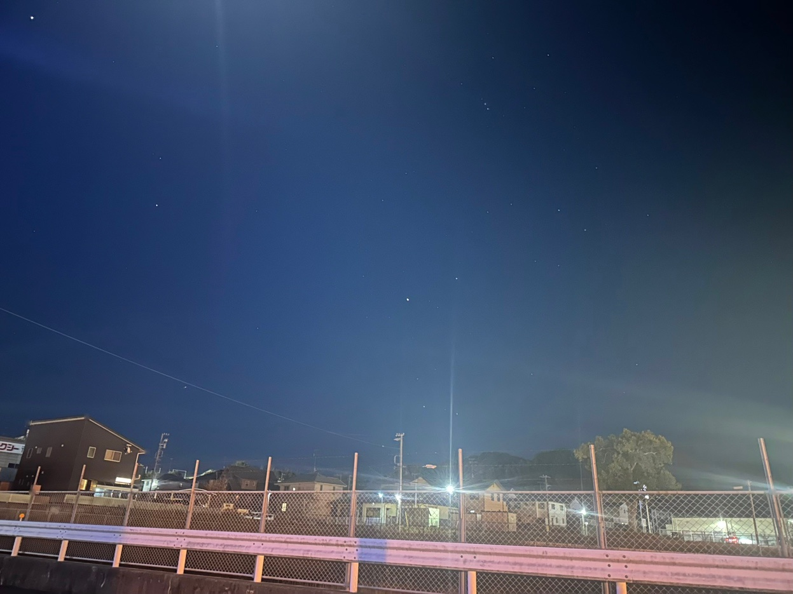
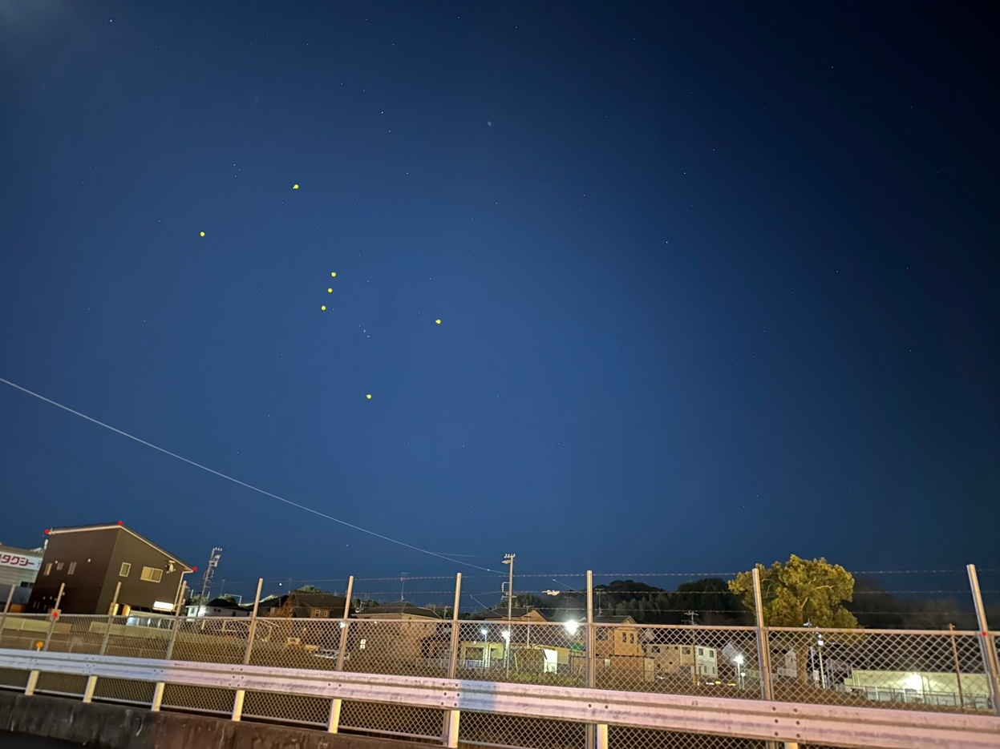
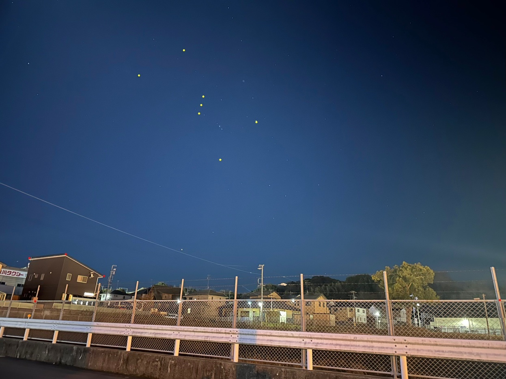
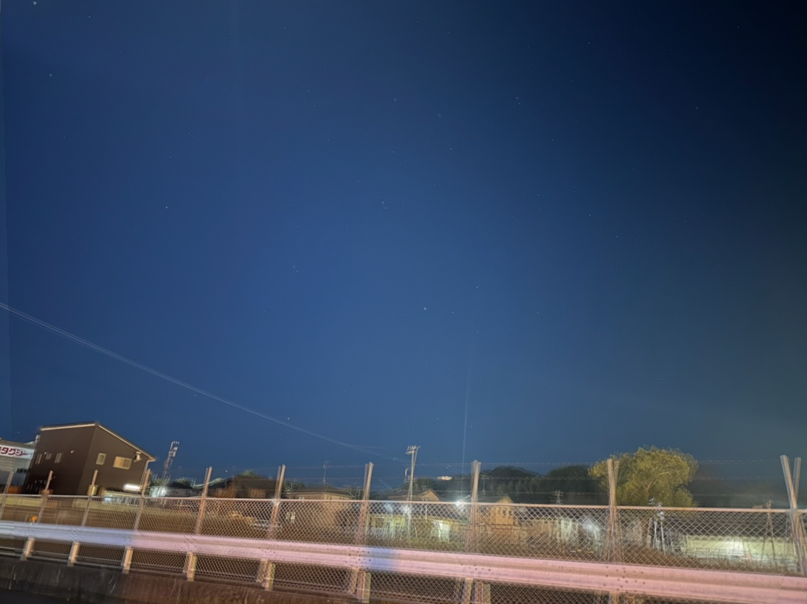
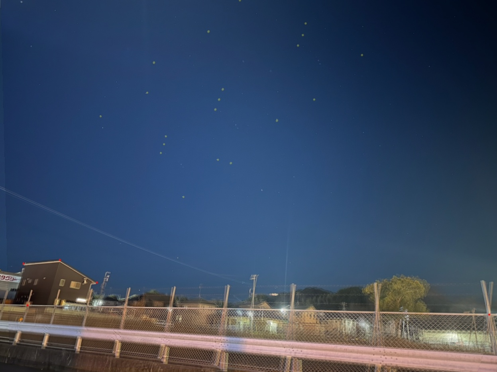

# オリオン座の日周運動 観測記録

## 観測情報

- **観測日**: 2025年1月2日
- **観測地**: 静岡県掛川市（北緯34°45'47" 東経138°01'21"）
- **観測時間**: 19:05 → 19:34 → 20:45（1時間40分）

---

## オリオン座の主要7星

※ 今回撮影した日時での配置に合わせて傾けてあります

---

## ファイル一覧

### 元画像

| サムネイル | ファイル名 | 説明 |
|:---:|-----------|------|
|  | [`01_original_1905.jpg`](01_original_1905.jpg) | 19:05撮影の元画像 |
|  | [`02_original_1934.jpg`](02_original_1934.jpg) | 19:34撮影の元画像 |
|  | [`03_original_2045.jpg`](03_original_2045.jpg) | 20:45撮影の元画像 |

※ iPhone上(HEIC)では凄くハッキリ星の配置が見えたが、JPEGに変換したら星が見えなくなってしまった…

### 座標検出用の手動マーカー付き画像

| サムネイル | ファイル名 | 説明 |
|:---:|-----------|------|
|  | [`04_marked_1905.jpg`](04_marked_1905.jpg) | 19:05の画像に星（黄色）と地上特徴点（赤色）をマーキング |
|  | [`05_marked_1934.jpg`](05_marked_1934.jpg) | 19:34の画像に星（黄色）と地上特徴点（赤色）をマーキング |
|  | [`06_marked_2045.jpg`](06_marked_2045.jpg) | 20:45の画像に星（黄色）と地上特徴点（赤色）をマーキング |

※ iPhone上では凄くハッキリ星の配置が見えていたので、iPhone上で先に手動で星の位置にマーキングを加えました。それをJPEG化した画像です。

**マーキング内容**:
- 黄色マーカー（6〜7個）: オリオン座の主要な星
  - ベテルギウス、ベラトリックス、アルニタク、アルニラム、ミンタカ、サイフ、リゲル
  - ※20:45ではベラトリックスは画面外
- 赤色マーカー（5個）: 地上の特徴点（画像合成の位置合わせ用）

### 合成画像

| サムネイル | ファイル名 | 説明 |
|:---:|-----------|------|
|  | [`07_composite.jpg`](07_composite.jpg) | 3枚の画像(星マーキングなし)を地上基準で合成した画像 |
|  | [`08_composite_marked.jpg`](08_composite_marked.jpg) | 3枚の画像(星マーキングあり)を地上基準で合成した画像 |

**合成方法**:
1. 地上の赤マーカー5点を使ってホモグラフィ変換行列を計算
2. 2枚目・3枚目を1枚目基準に変換（今回はカメラを固定しない手持ち撮影だったので、写っている範囲やカメラの確度違いがあるがそれを考慮して平行移動、回転、スケール調整、台形変形の処理を行う）
3. 3枚を不透明度1/3ずつにして加算合成
4. これにより地上が揃い、星の動きが軌跡として比較しやすくなった

### 完成画像

| サムネイル | ファイル名 | 説明 |
|:---:|-----------|------|
|  | [`09_final.jpg`](09_final.jpg) | 星座線と観測情報を追加した最終版 |

**追加情報**:
- 3時点のオリオン座を色分け表示（赤:19:05、緑:19:34、シアン:20:45）
- 星の移動軌跡をグレーの線で表示
- 20:45のベラトリックスは予測位置（破線で表示）
- 観測データと理論値の比較表

---

## アルニラムの方位・仰角

| 時刻 | 方位（実測） | 方位（理論） | 仰角（理論） |
|------|-------------|-------------|-------------|
| 19:05 | 南西 115° | 115° | 29° |
| 19:34 | 南西 123° | 120° | 34° |
| 20:45 | 南西 140° | 139° | 46° |

※方位はiPhoneのコンパスアプリでアルニラム（三連星の中央）の方角を計測した

---

## 観察のポイント

1. **日周運動の方向**: オリオン座は東（左下）から西（右上）へ移動
2. **移動速度**: 1時間40分で約25°移動（1時間あたり15°、1日=24時間あたり 24×15°=360° 地球の自転と一致！）
3. **実測と理論の一致**: コンパスアプリと天文計算アプリの理論値(日時と観察場所から計算)が3°以内で一致（iPhoneのコンパスアプリは手軽で十分優秀だった）

---

## ライセンス

[CC BY 4.0](LICENSE) - クレジット表示で自由に利用可能

© 2026 Yoshiaki Kawazu and family
